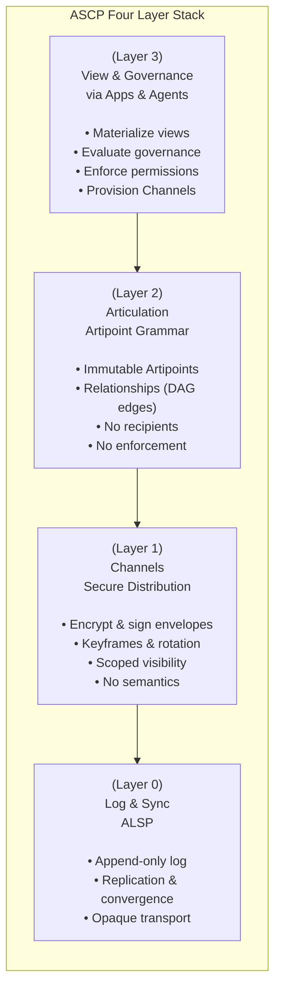

```mermaid
%%{init: {"flowchart": {"curve": "linear"}}}%%
flowchart LR

  %% --- Left: Layer Stack ---
  subgraph STACK["ASCP Four Layer Stack"]
    direction TB
    L3["(Layer 3)<br/>View & Governance<br/>via Apps & Agents<br/><br/>• Materialize views<br/>• Evaluate governance<br/>• Enforce permissions<br/>• Provision Channels"]
    L2["(Layer 2)<br/>Articulation<br/>Artipoint Grammar<br/><br/>• Immutable Artipoints<br/>• Relationships (DAG edges)<br/>• No recipients<br/>• No enforcement"]
    L1["(Layer 1)<br/>Channels<br/>Secure Distribution<br/><br/>• Encrypt & sign envelopes<br/>• Keyframes & rotation<br/>• Scoped visibility<br/>• No semantics"]
    L0["(Layer 0)<br/>Log & Sync<br/>ALSP<br/><br/>• Append-only log<br/>• Replication & convergence<br/>• Opaque transport"]
    L3 --> L2 --> L1 --> L0
  end
```
