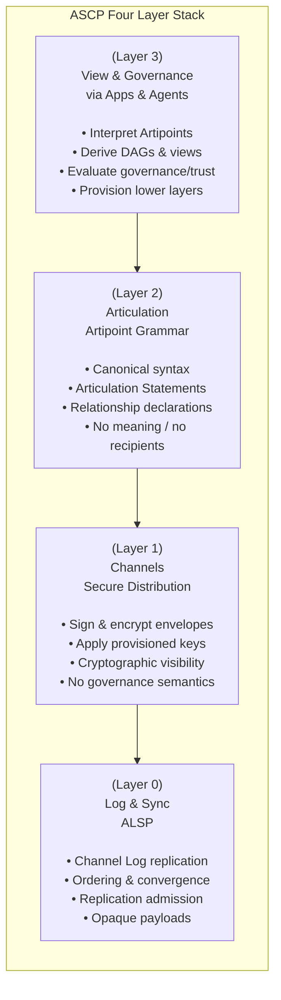

```mermaid
%%{init: {"flowchart": {"curve": "linear"}}}%%
flowchart LR

  %% --- Left: Layer Stack ---
  subgraph STACK["ASCP Four Layer Stack"]
    direction TB
    L3["(Layer 3)<br/>View & Governance<br/>via Apps & Agents<br/><br/>• Interpret Artipoints<br/>• Derive DAGs & views<br/>• Evaluate governance/trust<br/>• Provision lower layers"]
    L2["(Layer 2)<br/>Articulation<br/>Artipoint Grammar<br/><br/>• Canonical syntax<br/>• Articulation Statements<br/>• Relationship declarations<br/>• No meaning / no recipients"]
    L1["(Layer 1)<br/>Channels<br/>Secure Distribution<br/><br/>• Sign & encrypt envelopes<br/>• Apply provisioned keys<br/>• Cryptographic visibility<br/>• No governance semantics"]
    L0["(Layer 0)<br/>Log & Sync<br/>ALSP<br/><br/>• Channel Log replication<br/>• Ordering & convergence<br/>• Replication admission<br/>• Opaque payloads"]
    L3 --> L2 --> L1 --> L0
  end
```
